# Diagram Sistem — Tejas Coffee POS

Semua diagram di bawah memakai **Mermaid**, jadi bisa di-copy langsung ke:

- <https://mermaid.live> (paste → Export PNG/SVG)
- GitHub (blok ` ```mermaid ` otomatis ter-render di README/Markdown)
- VS Code (extension Markdown Preview Mermaid)
- Notion / Obsidian / draw.io (import Mermaid)

Daftar isi:

1. [Use Case Diagram](#1-use-case-diagram)
2. [Activity Diagram per Peran](#2-activity-diagram-per-peran)
3. [Flowchart per Peran](#3-flowchart-per-peran)
4. [Sequence Diagram](#4-sequence-diagram)
5. [ERD](#5-erd)
6. [Skema Database](#6-skema-database)
7. [Alur Transaksi](#7-alur-transaksi)

---

## 1. Use Case Diagram

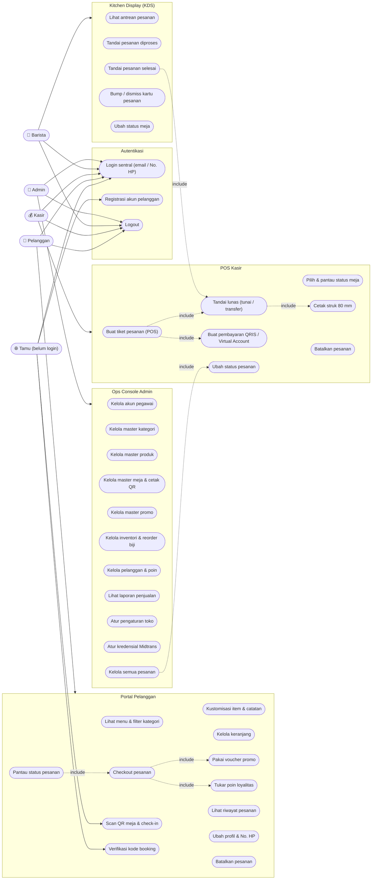
```mermaid
flowchart LR
    %% ===== AKTOR =====
    Admin(["👑 Admin"])
    Kasir(["💰 Kasir"])
    Barista(["🧹 Barista"])
    Pelanggan(["👤 Pelanggan"])
    Tamu(["🌐 Tamu (belum login)"])

    %% ===== USE CASE UMUM =====
    subgraph UMUM["Autentikasi"]
        UC01(["Login sentral (email / No. HP)"])
        UC02(["Registrasi akun pelanggan"])
        UC03(["Logout"])
    end

    %% ===== USE CASE PELANGGAN =====
    subgraph PEL["Portal Pelanggan"]
        UC10(["Lihat menu & filter kategori"])
        UC11(["Kustomisasi item & catatan"])
        UC12(["Kelola keranjang"])
        UC13(["Pakai voucher promo"])
        UC14(["Tukar poin loyalitas"])
        UC15(["Checkout pesanan"])
        UC16(["Scan QR meja & check-in"])
        UC17(["Verifikasi kode booking"])
        UC18(["Pantau status pesanan"])
        UC19(["Lihat riwayat pesanan"])
        UC20(["Ubah profil & No. HP"])
        UC21(["Batalkan pesanan"])
    end

    %% ===== USE CASE KASIR =====
    subgraph KAS["POS Kasir"]
        UC30(["Buat tiket pesanan (POS)"])
        UC31(["Pilih & pantau status meja"])
        UC32(["Tandai lunas (tunai / transfer)"])
        UC33(["Buat pembayaran QRIS / Virtual Account"])
        UC34(["Cetak struk 80 mm"])
        UC35(["Ubah status pesanan"])
        UC36(["Batalkan pesanan"])
    end

    %% ===== USE CASE BARISTA =====
    subgraph BAR["Kitchen Display (KDS)"]
        UC40(["Lihat antrean pesanan"])
        UC41(["Tandai pesanan diproses"])
        UC42(["Tandai pesanan selesai"])
        UC43(["Bump / dismiss kartu pesanan"])
        UC44(["Ubah status meja"])
    end

    %% ===== USE CASE ADMIN =====
    subgraph ADM["Ops Console Admin"]
        UC50(["Kelola akun pegawai"])
        UC51(["Kelola master kategori"])
        UC52(["Kelola master produk"])
        UC53(["Kelola master meja & cetak QR"])
        UC54(["Kelola master promo"])
        UC55(["Kelola inventori & reorder biji"])
        UC56(["Kelola pelanggan & poin"])
        UC57(["Lihat laporan penjualan"])
        UC58(["Atur pengaturan toko"])
        UC59(["Atur kredensial Midtrans"])
        UC60(["Kelola semua pesanan"])
    end

    %% ===== RELASI AKTOR =====
    Tamu --> UC01
    Tamu --> UC02
    Tamu --> UC16
    Tamu --> UC17

    Pelanggan --> UC01
    Pelanggan --> UC03
    Pelanggan --> PEL

    Kasir --> UC01
    Kasir --> UC03
    Kasir --> KAS

    Barista --> UC01
    Barista --> UC03
    Barista --> BAR

    Admin --> UC01
    Admin --> UC03
    Admin --> ADM

    %% ===== INCLUDE / EXTEND =====
    UC15 -.->|include| UC13
    UC15 -.->|include| UC14
    UC18 -.->|include| UC15
    UC30 -.->|include| UC32
    UC30 -.->|include| UC33
    UC32 -.->|include| UC34
    UC42 -.->|include| UC32
    UC60 -.->|include| UC35
```

---

## 2. Activity Diagram per Peran

### 2.1 Activity — Login & Otorisasi (semua peran)

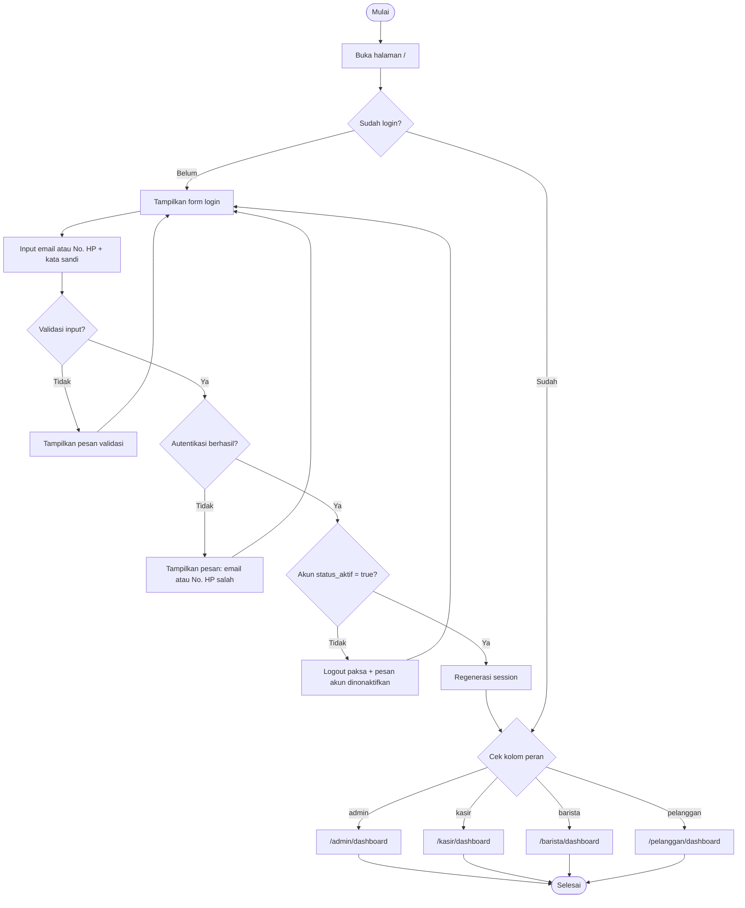
```mermaid
flowchart TD
    A([Mulai]) --> B[Buka halaman /]
    B --> C{Sudah login?}
    C -- Belum --> D[Tampilkan form login]
    D --> E[Input email atau No. HP + kata sandi]
    E --> F{Validasi input?}
    F -- Tidak --> G[Tampilkan pesan validasi] --> D
    F -- Ya --> H{Autentikasi berhasil?}
    H -- Tidak --> I[Tampilkan pesan: email atau No. HP salah] --> D
    H -- Ya --> J{Akun status_aktif = true?}
    J -- Tidak --> K[Logout paksa + pesan akun dinonaktifkan] --> D
    J -- Ya --> L[Regenerasi session]
    L --> M{Cek kolom peran}
    M -- admin --> N["/admin/dashboard"]
    M -- kasir --> O["/kasir/dashboard"]
    M -- barista --> P["/barista/dashboard"]
    M -- pelanggan --> Q["/pelanggan/dashboard"]
    N --> R([Selesai])
    O --> R
    P --> R
    Q --> R
    C -- Sudah --> M
```

### 2.2 Activity — Pelanggan Memesan & Membayar


```mermaid
flowchart TD
    A([Mulai]) --> B[Buka menu /pelanggan/menu]
    B --> C[Filter kategori / cari produk]
    C --> D[Pilih produk]
    D --> E{Butuh kustomisasi?}
    E -- Ya --> F[Atur opsi, jumlah, catatan]
    E -- Tidak --> G[Tambah langsung ke keranjang]
    F --> G
    G --> H[(Simpan keranjang di session)]
    H --> I{Lanjut belanja?}
    I -- Ya --> B
    I -- Tidak --> J[Buka keranjang]

    J --> K{Ubah jumlah / hapus item?}
    K -- Ya --> L[Update atau hapus item]
    L --> K
    K -- Tidak --> M{Pakai voucher?}
    M -- Ya --> N[Input kode promo]
    N --> O{Voucher aktif & dalam periode?}
    O -- Tidak --> P[Tampilkan error voucher] --> M
    O -- Ya --> Q[Simpan kode di session]
    M -- Tidak --> R{Tukar poin?}
    Q --> R
    R -- Ya --> S[Poin dipakai maks. min saldo, total/10]
    R -- Tidak --> T[Buka checkout]
    S --> T

    T --> U{Pilih tipe pesanan}
    U -- dine-in --> V[Pilih meja]
    U -- takeaway --> W[Nama & No. HP pelanggan]
    V --> W
    W --> X{No. HP akun terisi?}
    X -- Tidak --> Y[Redirect ke profil: lengkapi No. HP] --> W
    X -- Ya --> Z[Validasi ulang voucher & poin]

    Z --> AA["OrderController::store"]
    AA --> AB[Kunci baris produk lockForUpdate]
    AB --> AC{Stok mencukupi?}
    AC -- Tidak --> AD[HTTP 422: stok tidak cukup] --> J
    AC -- Ya --> AE[Hitung subtotal + diskon promo + poin + biaya layanan]
    AE --> AF[(INSERT pesanan status baru)]
    AF --> AG[(INSERT detail_pesanan)]
    AG --> AH[(UPDATE stok produk = stok - jumlah)]
    AH --> AI[(INSERT transaksi status menunggu)]
    AI --> AJ[Sinkron status meja]
    AJ --> AK[Kosongkan session keranjang/voucher/poin]
    AK --> AL[Redirect halaman status pesanan]

    AL --> AM{Pelanggan memilih bayar}
    AM -- Tunai di kasir --> AN[Kasir tandai lunas + kembalian]
    AM -- QRIS / VA --> AO[Kasir buat charge Midtrans]
    AN --> AP{Status pembayaran}
    AO --> AP
    AP -- lunas --> AQ[Poin member bertambah: 1 poin / Rp 10.000]
    AP -- menunggu --> AR[Polling status / webhook]
    AR --> AP
    AP -- gagal --> AS[Tampilkan gagal, minta metode lain] --> AM
    AQ --> AT[Barista memproses pesanan]
    AT --> AU[Kasir/barista menandai selesai]
    AU --> AV["Struk & riwayat pesanan"]
    AV --> AW([Selesai])
```

### 2.3 Activity — Pelanggan / Tamu Scan QR Meja

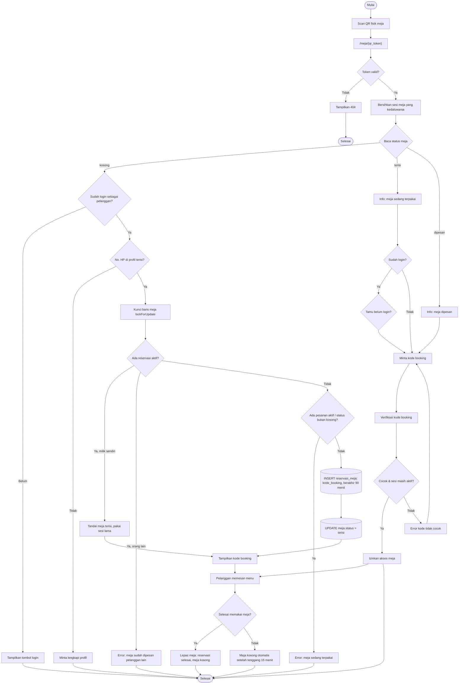
```mermaid
flowchart TD
    A([Mulai]) --> B[Scan QR fisik meja]
    B --> C["/meja/{qr_token}"]
    C --> D{Token valid?}
    D -- Tidak --> E[Tampilkan 404] --> Z([Selesai])
    D -- Ya --> F[Bersihkan sesi meja yang kedaluwarsa]
    F --> G{Baca status meja}

    G -- kosong --> H{Sudah login sebagai pelanggan?}
    H -- Belum --> I[Tampilkan tombol login] --> J([Selesai])
    H -- Ya --> K{No. HP di profil terisi?}
    K -- Tidak --> L[Minta lengkapi profil] --> J
    K -- Ya --> M[Kunci baris meja lockForUpdate]
    M --> N{Ada reservasi aktif?}
    N -- Ya, milik sendiri --> O[Tandai meja terisi, pakai sesi lama] --> P
    N -- Ya, orang lain --> Q[Error: meja sudah dipesan pelanggan lain] --> J
    N -- Tidak --> R{Ada pesanan aktif / status bukan kosong?}
    R -- Ya --> S[Error: meja sedang terpakai] --> J
    R -- Tidak --> T[(INSERT reservasi_meja: kode_booking, berakhir 90 menit)]
    T --> U[(UPDATE meja.status = terisi)]
    U --> P[Tampilkan kode booking]
    P --> V[Pelanggan memesan menu]
    V --> W{Selesai memakai meja?}
    W -- Ya --> X[Lepas meja: reservasi selesai, meja kosong]
    W -- Tidak --> Y[Meja kosong otomatis setelah tenggang 15 menit]
    X --> J
    Y --> J

    G -- terisi --> AA[Info: meja sedang terpakai]
    AA --> AB{Sudah login?}
    AB -- Ya --> AC{Tamu belum login?}
    AB -- Tidak --> AD[Minta kode booking]
    AC --> AD
    AD --> AE[Verifikasi kode booking]
    AE --> AF{Cocok & sesi masih aktif?}
    AF -- Ya --> AG[Izinkan akses meja] --> V
    AF -- Tidak --> AH[Error kode tidak cocok] --> AD
    AG --> J

    G -- dipesan --> AI[Info: meja dipesan] --> AD
```

### 2.4 Activity — Kasir (POS)

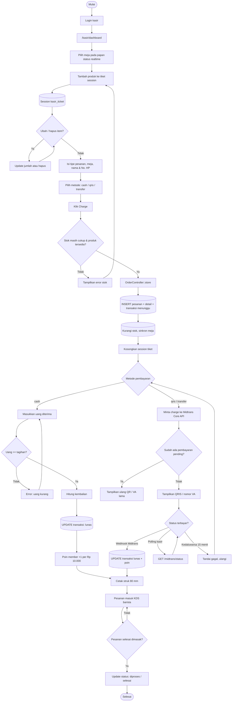
```mermaid
flowchart TD
    A([Mulai]) --> B[Login kasir]
    B --> C["/kasir/dashboard"]
    C --> D[Pilih meja pada papan status realtime]
    D --> E[Tambah produk ke tiket session]
    E --> F[(Session kasir_ticket)]
    F --> G{Ubah / hapus item?}
    G -- Ya --> H[Update jumlah atau hapus] --> G
    G -- Tidak --> I[Isi tipe pesanan, meja, nama & No. HP]
    I --> J[Pilih metode: cash / qris / transfer]
    J --> K[Klik Charge]
    K --> L{Stok masih cukup & produk tersedia?}
    L -- Tidak --> M[Tampilkan error stok] --> E
    L -- Ya --> N["OrderController::store"]

    N --> O[(INSERT pesanan + detail + transaksi menunggu)]
    O --> P[(Kurangi stok, sinkron meja)]
    P --> Q[Kosongkan session tiket]
    Q --> R{Metode pembayaran}

    R -- cash --> S[Masukkan uang diterima]
    S --> T{Uang >= tagihan?}
    T -- Tidak --> U[Error: uang kurang] --> S
    T -- Ya --> V[Hitung kembalian]
    V --> W[(UPDATE transaksi: lunas)]
    W --> X[Poin member +1 per Rp 10.000]

    R -- qris / transfer --> Y[Minta charge ke Midtrans Core API]
    Y --> Z{Sudah ada pembayaran pending?}
    Z -- Ya --> AA[Tampilkan ulang QR / VA lama]
    Z -- Tidak --> AB[Tampilkan QRIS / nomor VA]
    AB --> AC{Status terbayar?}
    AC -- Webhook Midtrans --> AD[(UPDATE transaksi lunas + poin)]
    AC -- Polling kasir --> AE[GET /midtrans/status] --> AC
    AC -- Kedaluwarsa 15 menit --> AF[Tandai gagal, ulangi]

    X --> AG[Cetak struk 80 mm]
    AD --> AG
    AF --> R
    AG --> AH[Pesanan masuk KDS barista]
    AH --> AI{Pesanan selesai dimasak?}
    AI -- Ya --> AJ[Update status: diproses / selesai]
    AI -- Tidak --> AH
    AJ --> AK([Selesai])
```

### 2.5 Activity — Barista (KDS)

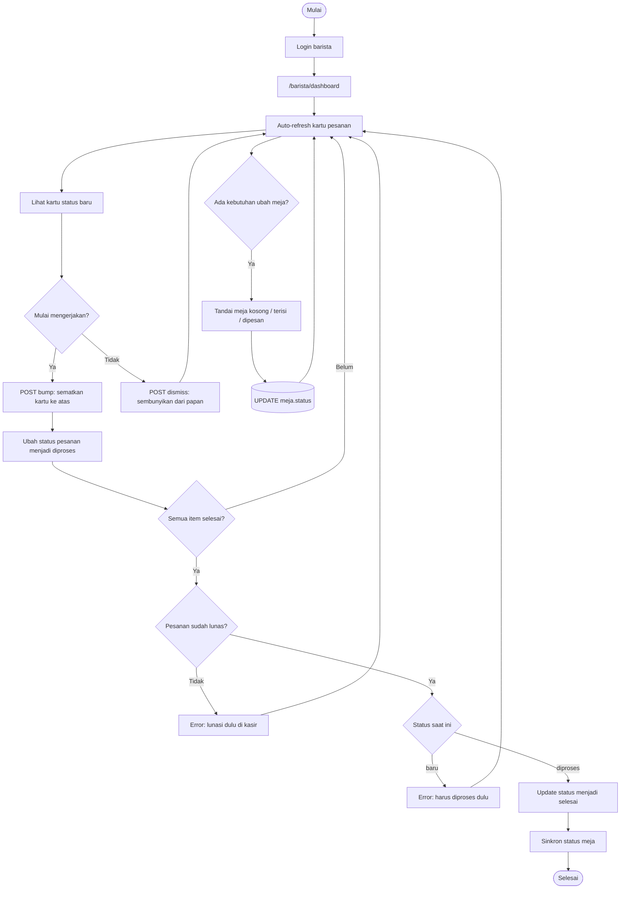
```mermaid
flowchart TD
    A([Mulai]) --> B[Login barista]
    B --> C["/barista/dashboard"]
    C --> D[Auto-refresh kartu pesanan]
    D --> E[Lihat kartu status baru]
    E --> F{Mulai mengerjakan?}
    F -- Ya --> G[POST bump: sematkan kartu ke atas]
    G --> H[Ubah status pesanan menjadi diproses]
    F -- Tidak --> I[POST dismiss: sembunyikan dari papan]
    I --> D

    H --> J{Semua item selesai?}
    J -- Belum --> D
    J -- Ya --> K{Pesanan sudah lunas?}
    K -- Tidak --> L[Error: lunasi dulu di kasir] --> D
    K -- Ya --> M{Status saat ini}
    M -- baru --> N[Error: harus diproses dulu] --> D
    M -- diproses --> O[Update status menjadi selesai]
    O --> P[Sinkron status meja]
    P --> Q([Selesai])

    D --> R{Ada kebutuhan ubah meja?}
    R -- Ya --> S[Tandai meja kosong / terisi / dipesan]
    S --> T[(UPDATE meja.status)]
    T --> D
```

### 2.6 Activity — Admin

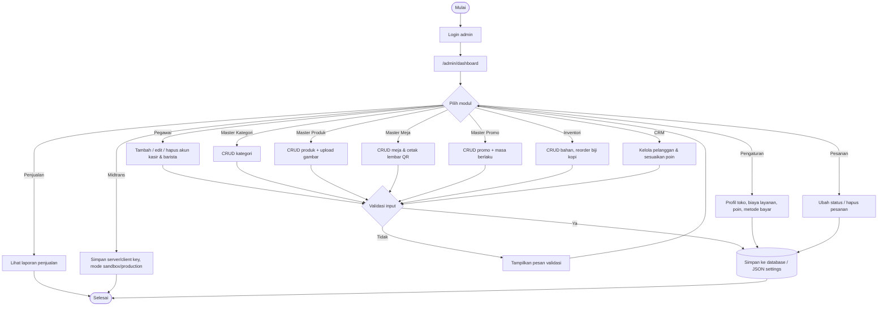
```mermaid
flowchart TD
    A([Mulai]) --> B[Login admin]
    B --> C["/admin/dashboard"]
    C --> D{Pilih modul}

    D -- Pegawai --> E[Tambah / edit / hapus akun kasir & barista]
    D -- Master Kategori --> F[CRUD kategori]
    D -- Master Produk --> G[CRUD produk + upload gambar]
    D -- Master Meja --> H[CRUD meja & cetak lembar QR]
    D -- Master Promo --> I[CRUD promo + masa berlaku]
    D -- Inventori --> J[CRUD bahan, reorder biji kopi]
    D -- CRM --> K[Kelola pelanggan & sesuaikan poin]
    D -- Penjualan --> L[Lihat laporan penjualan]
    D -- Pengaturan --> M[Profil toko, biaya layanan, poin, metode bayar]
    D -- Midtrans --> N[Simpan server/client key, mode sandbox/production]
    D -- Pesanan --> O[Ubah status / hapus pesanan]

    E --> P{Validasi input}
    F --> P
    G --> P
    H --> P
    I --> P
    J --> P
    K --> P
    L --> Q([Selesai])
    N --> Q
    P -- Tidak --> R[Tampilkan pesan validasi] --> D
    P -- Ya --> S[(Simpan ke database / JSON settings)]
    S --> Q
    M --> S
    O --> S
```

---

## 3. Flowchart per Peran

Flowchart ini versi ringkas alur navigasi (bukan detail validasi), cocok untuk lampiran laporan.

### 3.1 Flowchart Pelanggan


```mermaid
flowchart LR
    A([Mulai]) --> B[Buka aplikasi]
    B --> C{punya akun?}
    C -- belum --> D[Registrasi] --> E[Login]
    C -- sudah --> E
    E --> F[Dashboard pelanggan]
    F --> G[Menu]
    G --> H{scan QR meja?}
    H -- ya --> I[Check-in meja] --> J
    H -- tidak --> J[Pilih produk & kustom]
    J --> K[Keranjang]
    K --> L[Checkout]
    L --> M[Pesanan dibuat]
    M --> N[Bayar]
    N --> O[Status pesanan]
    O --> P{selesai?}
    P -- belum --> O
    P -- ya --> Q[Riwayat & poin]
    Q --> R([Selesai])
```

### 3.2 Flowchart Kasir

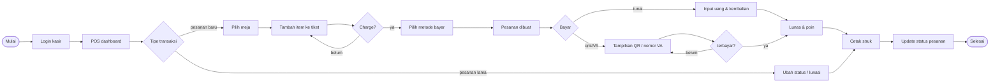
```mermaid
flowchart LR
    A([Mulai]) --> B[Login kasir]
    B --> C[POS dashboard]
    C --> D{Tipe transaksi}
    D -- pesanan baru --> E[Pilih meja]
    E --> F[Tambah item ke tiket]
    F --> G{Charge?}
    G -- belum --> F
    G -- ya --> H[Pilih metode bayar]
    H --> I[Pesanan dibuat]
    I --> J{Bayar}
    J -- tunai --> K[Input uang & kembalian]
    J -- qris/VA --> L[Tampilkan QR / nomor VA]
    K --> M[Lunas & poin]
    L --> N{terbayar?}
    N -- belum --> L
    N -- ya --> M
    M --> O[Cetak struk]
    O --> P[Update status pesanan]
    D -- pesanan lama --> Q[Ubah status / lunasi]
    Q --> O
    P --> R([Selesai])
```

### 3.3 Flowchart Barista

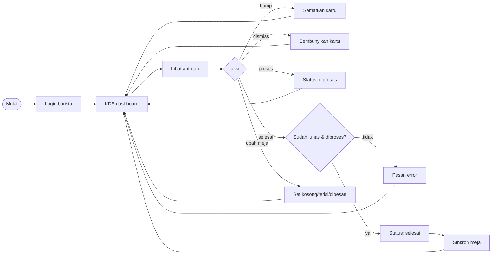
```mermaid
flowchart LR
    A([Mulai]) --> B[Login barista]
    B --> C[KDS dashboard]
    C --> D[Lihat antrean]
    D --> E{aksi}
    E -- bump --> F[Sematkan kartu]
    E -- dismiss --> G[Sembunyikan kartu]
    E -- proses --> H[Status: diproses]
    E -- selesai --> I{Sudah lunas & diproses?}
    I -- tidak --> J[Pesan error] --> C
    I -- ya --> K[Status: selesai]
    K --> L[Sinkron meja]
    E -- ubah meja --> M[Set kosong/terisi/dipesan]
    F --> C
    G --> C
    H --> C
    L --> C
    M --> C
```

### 3.4 Flowchart Admin

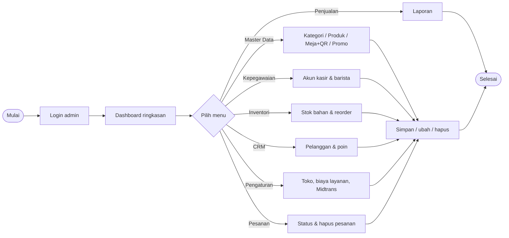
```mermaid
flowchart LR
    A([Mulai]) --> B[Login admin]
    B --> C[Dashboard ringkasan]
    C --> D{Pilih menu}
    D -- Master Data --> E[Kategori / Produk / Meja+QR / Promo]
    D -- Kepegawaian --> F[Akun kasir & barista]
    D -- Inventori --> G[Stok bahan & reorder]
    D -- CRM --> H[Pelanggan & poin]
    D -- Penjualan --> I[Laporan]
    D -- Pengaturan --> J[Toko, biaya layanan, Midtrans]
    D -- Pesanan --> K[Status & hapus pesanan]
    E --> L[Simpan / ubah / hapus]
    F --> L
    G --> L
    H --> L
    J --> L
    K --> L
    I --> M([Selesai])
    L --> M
```

### 3.5 Flowchart Tamu (tanpa akun)

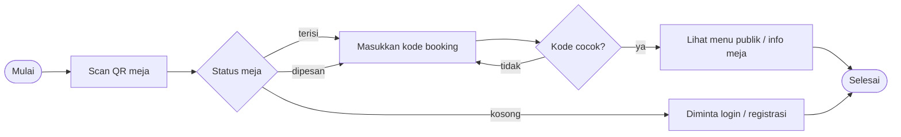
```mermaid
flowchart LR
    A([Mulai]) --> B[Scan QR meja]
    B --> C{Status meja}
    C -- kosong --> D[Diminta login / registrasi]
    C -- terisi --> E[Masukkan kode booking]
    C -- dipesan --> E
    E --> F{Kode cocok?}
    F -- tidak --> E
    F -- ya --> G[Lihat menu publik / info meja]
    G --> H([Selesai])
    D --> H
```

---

## 4. Sequence Diagram

### 4.1 Sequence — Login & RBAC

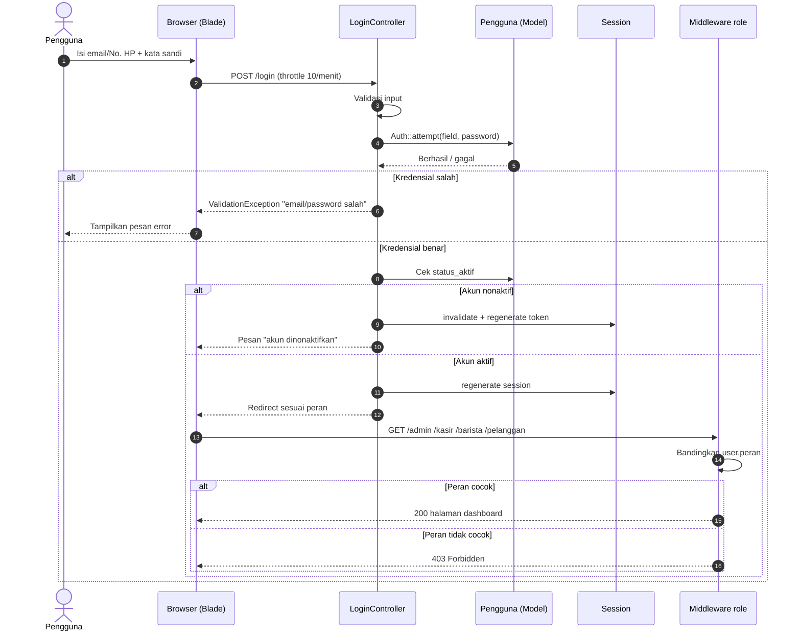
```mermaid
sequenceDiagram
    autonumber
    actor U as Pengguna
    participant B as Browser (Blade)
    participant L as LoginController
    participant M as Pengguna (Model)
    participant S as Session
    participant MW as Middleware role

    U->>B: Isi email/No. HP + kata sandi
    B->>L: POST /login (throttle 10/menit)
    L->>L: Validasi input
    L->>M: Auth::attempt(field, password)
    M-->>L: Berhasil / gagal
    alt Kredensial salah
        L-->>B: ValidationException "email/password salah"
        B-->>U: Tampilkan pesan error
    else Kredensial benar
        L->>M: Cek status_aktif
        alt Akun nonaktif
            L->>S: invalidate + regenerate token
            L-->>B: Pesan "akun dinonaktifkan"
        else Akun aktif
            L->>S: regenerate session
            L-->>B: Redirect sesuai peran
            B->>MW: GET /admin /kasir /barista /pelanggan
            MW->>MW: Bandingkan user.peran
            alt Peran cocok
                MW-->>B: 200 halaman dashboard
            else Peran tidak cocok
                MW-->>B: 403 Forbidden
            end
        end
    end
```

### 4.2 Sequence — Checkout Pelanggan (pembuatan pesanan)

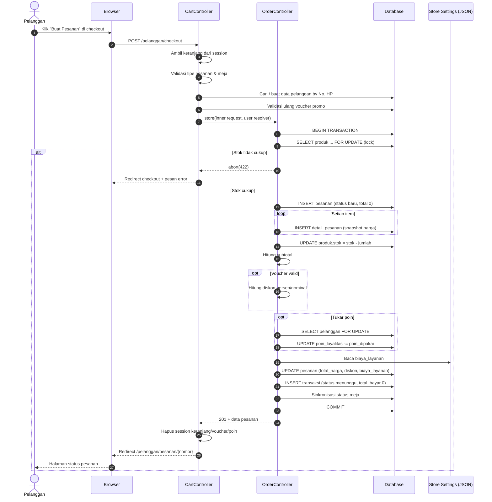
```mermaid
sequenceDiagram
    autonumber
    actor P as Pelanggan
    participant B as Browser
    participant C as CartController
    participant O as OrderController
    participant DB as Database
    participant SET as Store Settings (JSON)

    P->>B: Klik "Buat Pesanan" di checkout
    B->>C: POST /pelanggan/checkout
    C->>C: Ambil keranjang dari session
    C->>C: Validasi tipe pesanan & meja
    C->>DB: Cari / buat data pelanggan by No. HP
    C->>DB: Validasi ulang voucher promo
    C->>O: store(inner request, user resolver)

    O->>DB: BEGIN TRANSACTION
    O->>DB: SELECT produk ... FOR UPDATE (lock)
    alt Stok tidak cukup
        O-->>C: abort(422)
        C-->>B: Redirect checkout + pesan error
    else Stok cukup
        O->>DB: INSERT pesanan (status baru, total 0)
        loop Setiap item
            O->>DB: INSERT detail_pesanan (snapshot harga)
        end
        O->>DB: UPDATE produk.stok = stok - jumlah
        O->>O: Hitung subtotal
        opt Voucher valid
            O->>O: Hitung diskon persen/nominal
        end
        opt Tukar poin
            O->>DB: SELECT pelanggan FOR UPDATE
            O->>DB: UPDATE poin_loyalitas -= poin_dipakai
        end
        O->>SET: Baca biaya_layanan
        O->>DB: UPDATE pesanan (total_harga, diskon, biaya_layanan)
        O->>DB: INSERT transaksi (status menunggu, total_bayar 0)
        O->>DB: Sinkronisasi status meja
        O->>DB: COMMIT
        O-->>C: 201 + data pesanan
        C->>C: Hapus session keranjang/voucher/poin
        C-->>B: Redirect /pelanggan/pesanan/{nomor}
        B-->>P: Halaman status pesanan
    end
```

### 4.3 Sequence — Pembayaran QRIS Midtrans & Webhook

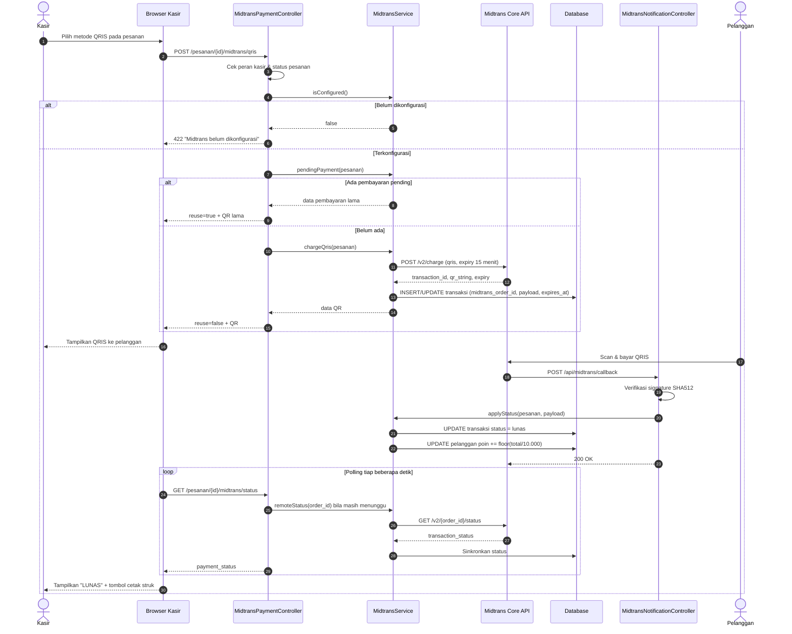
```mermaid
sequenceDiagram
    autonumber
    actor K as Kasir
    participant B as Browser Kasir
    participant PC as MidtransPaymentController
    participant MS as MidtransService
    participant MT as Midtrans Core API
    participant DB as Database
    participant WH as MidtransNotificationController
    actor P as Pelanggan

    K->>B: Pilih metode QRIS pada pesanan
    B->>PC: POST /pesanan/{id}/midtrans/qris
    PC->>PC: Cek peran kasir & status pesanan
    PC->>MS: isConfigured()
    alt Belum dikonfigurasi
        MS-->>PC: false
        PC-->>B: 422 "Midtrans belum dikonfigurasi"
    else Terkonfigurasi
        PC->>MS: pendingPayment(pesanan)
        alt Ada pembayaran pending
            MS-->>PC: data pembayaran lama
            PC-->>B: reuse=true + QR lama
        else Belum ada
            PC->>MS: chargeQris(pesanan)
            MS->>MT: POST /v2/charge (qris, expiry 15 menit)
            MT-->>MS: transaction_id, qr_string, expiry
            MS->>DB: INSERT/UPDATE transaksi (midtrans_order_id, payload, expires_at)
            MS-->>PC: data QR
            PC-->>B: reuse=false + QR
        end
        B-->>K: Tampilkan QRIS ke pelanggan
        P->>MT: Scan & bayar QRIS
        MT->>WH: POST /api/midtrans/callback
        WH->>WH: Verifikasi signature SHA512
        WH->>MS: applyStatus(pesanan, payload)
        MS->>DB: UPDATE transaksi status = lunas
        MS->>DB: UPDATE pelanggan poin += floor(total/10.000)
        WH-->>MT: 200 OK
        loop Polling tiap beberapa detik
            B->>PC: GET /pesanan/{id}/midtrans/status
            PC->>MS: remoteStatus(order_id) bila masih menunggu
            MS->>MT: GET /v2/{order_id}/status
            MT-->>MS: transaction_status
            MS->>DB: Sinkronkan status
            PC-->>B: payment_status
        end
        B-->>K: Tampilkan "LUNAS" + tombol cetak struk
    end
```

### 4.4 Sequence — Check-in Meja via QR

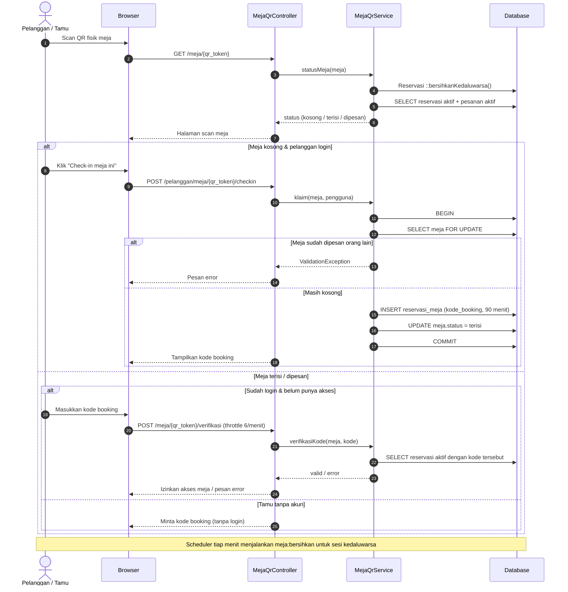
```mermaid
sequenceDiagram
    autonumber
    actor P as Pelanggan / Tamu
    participant B as Browser
    participant Q as MejaQrController
    participant S as MejaQrService
    participant DB as Database

    P->>B: Scan QR fisik meja
    B->>Q: GET /meja/{qr_token}
    Q->>S: statusMeja(meja)
    S->>DB: Reservasi ::bersihkanKedaluwarsa()
    S->>DB: SELECT reservasi aktif + pesanan aktif
    S-->>Q: status (kosong / terisi / dipesan)
    Q-->>B: Halaman scan meja

    alt Meja kosong & pelanggan login
        P->>B: Klik "Check-in meja ini"
        B->>Q: POST /pelanggan/meja/{qr_token}/checkin
        Q->>S: klaim(meja, pengguna)
        S->>DB: BEGIN
        S->>DB: SELECT meja FOR UPDATE
        alt Meja sudah dipesan orang lain
            S-->>Q: ValidationException
            Q-->>B: Pesan error
        else Masih kosong
            S->>DB: INSERT reservasi_meja (kode_booking, 90 menit)
            S->>DB: UPDATE meja.status = terisi
            S->>DB: COMMIT
            Q-->>B: Tampilkan kode booking
        end
    else Meja terisi / dipesan
        alt Sudah login & belum punya akses
            P->>B: Masukkan kode booking
            B->>Q: POST /meja/{qr_token}/verifikasi (throttle 6/menit)
            Q->>S: verifikasiKode(meja, kode)
            S->>DB: SELECT reservasi aktif dengan kode tersebut
            S-->>Q: valid / error
            Q-->>B: Izinkan akses meja / pesan error
        else Tamu tanpa akun
            Q-->>B: Minta kode booking (tanpa login)
        end
    end

    Note over P,DB: Scheduler tiap menit menjalankan meja:bersihkan untuk sesi kedaluwarsa
```

### 4.5 Sequence — Kasir Melunasi Tunai

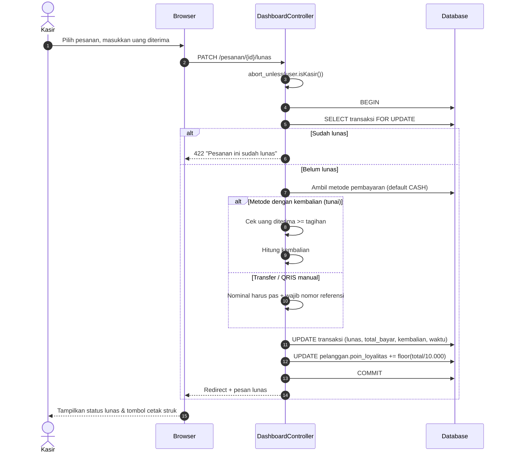
```mermaid
sequenceDiagram
    autonumber
    actor K as Kasir
    participant B as Browser
    participant D as DashboardController
    participant DB as Database

    K->>B: Pilih pesanan, masukkan uang diterima
    B->>D: PATCH /pesanan/{id}/lunas
    D->>D: abort_unless(user.isKasir())

    D->>DB: BEGIN
    D->>DB: SELECT transaksi FOR UPDATE
    alt Sudah lunas
        D-->>B: 422 "Pesanan ini sudah lunas"
    else Belum lunas
        D->>DB: Ambil metode pembayaran (default CASH)
        alt Metode dengan kembalian (tunai)
            D->>D: Cek uang diterima >= tagihan
            D->>D: Hitung kembalian
        else Transfer / QRIS manual
            D->>D: Nominal harus pas + wajib nomor referensi
        end
        D->>DB: UPDATE transaksi (lunas, total_bayar, kembalian, waktu)
        D->>DB: UPDATE pelanggan.poin_loyalitas += floor(total/10.000)
        D->>DB: COMMIT
        D-->>B: Redirect + pesan lunas
    end
    B-->>K: Tampilkan status lunas & tombol cetak struk
```

---

## 5. ERD

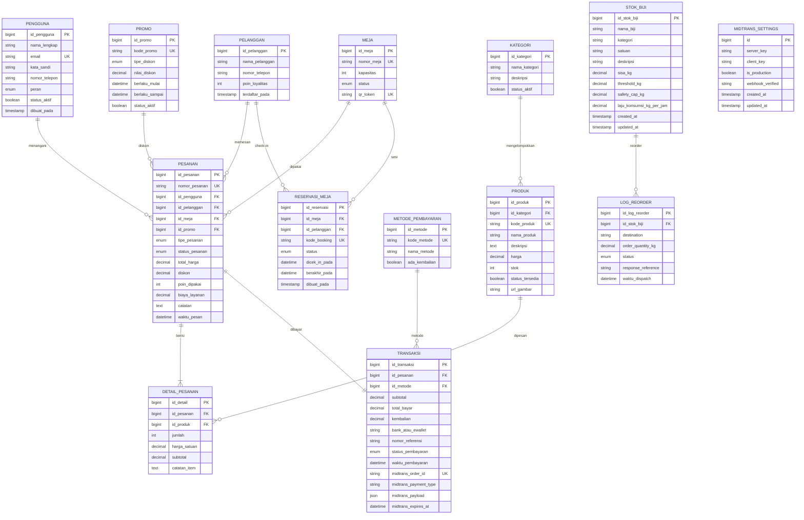
```mermaid
erDiagram
    PENGGUNA ||--o{ PESANAN : "menangani"
    PELANGGAN ||--o{ PESANAN : "memesan"
    MEJA ||--o{ PESANAN : "dipakai"
    PROMO ||--o{ PESANAN : "diskon"
    PESANAN ||--|{ DETAIL_PESANAN : "berisi"
    PRODUK ||--o{ DETAIL_PESANAN : "dipesan"
    KATEGORI ||--o{ PRODUK : "mengelompokkan"
    PESANAN ||--|| TRANSAKSI : "dibayar"
    METODE_PEMBAYARAN ||--o{ TRANSAKSI : "metode"
    MEJA ||--o{ RESERVASI_MEJA : "sesi"
    PELANGGAN ||--o{ RESERVASI_MEJA : "check-in"
    STOK_BIJI ||--o{ LOG_REORDER : "reorder"

    PENGGUNA {
        bigint id_pengguna PK
        string nama_lengkap
        string email UK
        string kata_sandi
        string nomor_telepon
        enum peran
        boolean status_aktif
        timestamp dibuat_pada
    }

    PELANGGAN {
        bigint id_pelanggan PK
        string nama_pelanggan
        string nomor_telepon
        int poin_loyalitas
        timestamp terdaftar_pada
    }

    KATEGORI {
        bigint id_kategori PK
        string nama_kategori
        string deskripsi
        boolean status_aktif
    }

    PRODUK {
        bigint id_produk PK
        bigint id_kategori FK
        string kode_produk UK
        string nama_produk
        text deskripsi
        decimal harga
        int stok
        boolean status_tersedia
        string url_gambar
    }

    MEJA {
        bigint id_meja PK
        string nomor_meja UK
        int kapasitas
        enum status
        string qr_token UK
    }

    RESERVASI_MEJA {
        bigint id_reservasi PK
        bigint id_meja FK
        bigint id_pelanggan FK
        string kode_booking UK
        enum status
        datetime dicek_in_pada
        datetime berakhir_pada
        timestamp dibuat_pada
    }

    PROMO {
        bigint id_promo PK
        string kode_promo UK
        enum tipe_diskon
        decimal nilai_diskon
        datetime berlaku_mulai
        datetime berlaku_sampai
        boolean status_aktif
    }

    PESANAN {
        bigint id_pesanan PK
        string nomor_pesanan UK
        bigint id_pengguna FK
        bigint id_pelanggan FK
        bigint id_meja FK
        bigint id_promo FK
        enum tipe_pesanan
        enum status_pesanan
        decimal total_harga
        decimal diskon
        int poin_dipakai
        decimal biaya_layanan
        text catatan
        datetime waktu_pesan
    }

    DETAIL_PESANAN {
        bigint id_detail PK
        bigint id_pesanan FK
        bigint id_produk FK
        int jumlah
        decimal harga_satuan
        decimal subtotal
        text catatan_item
    }

    METODE_PEMBAYARAN {
        bigint id_metode PK
        string kode_metode UK
        string nama_metode
        boolean ada_kembalian
    }

    TRANSAKSI {
        bigint id_transaksi PK
        bigint id_pesanan FK
        bigint id_metode FK
        decimal subtotal
        decimal total_bayar
        decimal kembalian
        string bank_atau_ewallet
        string nomor_referensi
        enum status_pembayaran
        datetime waktu_pembayaran
        string midtrans_order_id UK
        string midtrans_payment_type
        json midtrans_payload
        datetime midtrans_expires_at
    }

    STOK_BIJI {
        bigint id_stok_biji PK
        string nama_biji
        string kategori
        string satuan
        string deskripsi
        decimal sisa_kg
        decimal threshold_kg
        decimal safety_cap_kg
        decimal laju_konsumsi_kg_per_jam
        timestamp created_at
        timestamp updated_at
    }

    LOG_REORDER {
        bigint id_log_reorder PK
        bigint id_stok_biji FK
        string destination
        decimal order_quantity_kg
        enum status
        string response_reference
        datetime waktu_dispatch
    }

    MIDTRANS_SETTINGS {
        bigint id PK
        string server_key
        string client_key
        boolean is_production
        string webhook_verified
        timestamp created_at
        timestamp updated_at
    }
```

---

## 6. Skema Database

### 6.1 Gambaran relasi (ringkas)

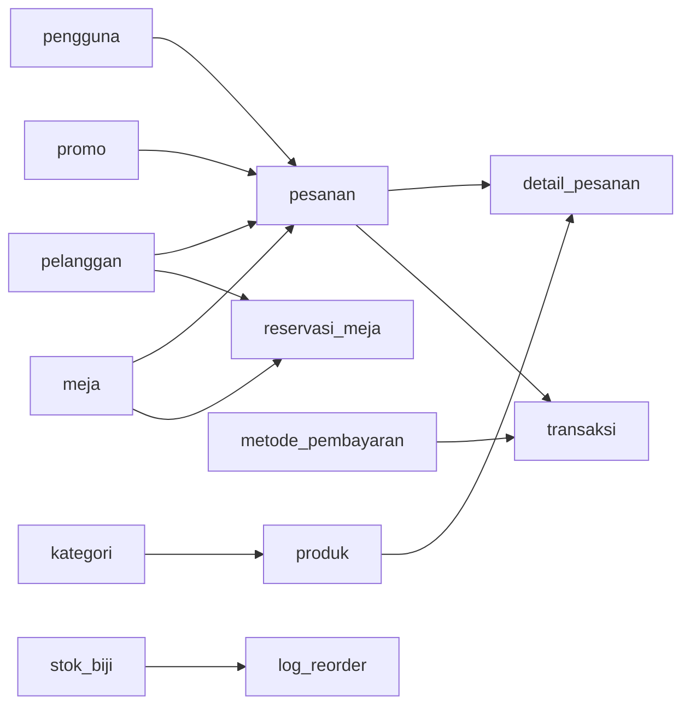
```mermaid
flowchart LR
    pengguna --> pesanan
    pelanggan --> pesanan
    meja --> pesanan
    promo --> pesanan
    pesanan --> detail_pesanan
    produk --> detail_pesanan
    kategori --> produk
    pesanan --> transaksi
    metode_pembayaran --> transaksi
    meja --> reservasi_meja
    pelanggan --> reservasi_meja
    stok_biji --> log_reorder
```

### 6.2 Kamus tabel

**`pengguna`** — akun login semua peran (tabel `users` Laravel diganti nama).

| Kolom | Tipe | Keterangan |
|---|---|---|
| `id_pengguna` | BIGINT UNSIGNED PK | Auto increment |
| `nama_lengkap` | VARCHAR(255) | |
| `email` | VARCHAR(255) UNIQUE | Login alternatif |
| `kata_sandi` | VARCHAR(255) | Hash bcrypt, cast `hashed` |
| `nomor_telepon` | VARCHAR(20) NULL | Login alternatif + pencocokan member |
| `peran` | ENUM(admin, kasir, barista, pelanggan) | Default `pelanggan` |
| `status_aktif` | BOOLEAN | Default `1`; akun nonaktif dipaksa logout |
| `dibuat_pada` | TIMESTAMP | Default CURRENT_TIMESTAMP |

**`pelanggan`** — data member & poin.

| Kolom | Tipe | Keterangan |
|---|---|---|
| `id_pelanggan` | BIGINT UNSIGNED PK | |
| `nama_pelanggan` | VARCHAR(255) | |
| `nomor_telepon` | VARCHAR(20) NULL | Kunci pencocokan dengan `pengguna.nomor_telepon` |
| `poin_loyalitas` | INT UNSIGNED | Default `0` |
| `terdaftar_pada` | TIMESTAMP | Default CURRENT_TIMESTAMP |

**`kategori`** — kategori menu.

| Kolom | Tipe | Keterangan |
|---|---|---|
| `id_kategori` | BIGINT UNSIGNED PK | |
| `nama_kategori` | VARCHAR(255) | |
| `deskripsi` | VARCHAR(255) NULL | |
| `status_aktif` | BOOLEAN | Default `1` |

**`produk`** — menu.

| Kolom | Tipe | Keterangan |
|---|---|---|
| `id_produk` | BIGINT UNSIGNED PK | |
| `id_kategori` | BIGINT UNSIGNED FK → `kategori.id_kategori` | ON DELETE CASCADE |
| `kode_produk` | VARCHAR(255) UNIQUE | Contoh `CF-001` |
| `nama_produk` | VARCHAR(255) | |
| `deskripsi` | TEXT NULL | |
| `harga` | DECIMAL(10,2) | |
| `stok` | INT UNSIGNED | Default `0` |
| `status_tersedia` | BOOLEAN | Default `1` |
| `url_gambar` | VARCHAR(255) NULL | Path `public/images/...` |

Index: `(id_kategori, status_tersedia)`.

**`meja`** — meja fisik.

| Kolom | Tipe | Keterangan |
|---|---|---|
| `id_meja` | BIGINT UNSIGNED PK | |
| `nomor_meja` | VARCHAR(255) UNIQUE | Contoh `M01` |
| `kapasitas` | INT UNSIGNED | |
| `status` | ENUM(kosong, terisi, dipesan) | Default `kosong` |
| `qr_token` | VARCHAR(64) NULL UNIQUE | Token acak 40 karakter untuk QR fisik |

**`reservasi_meja`** — sesi pemakaian meja.

| Kolom | Tipe | Keterangan |
|---|---|---|
| `id_reservasi` | BIGINT UNSIGNED PK | |
| `id_meja` | BIGINT UNSIGNED FK → `meja` | ON DELETE CASCADE |
| `id_pelanggan` | BIGINT UNSIGNED FK → `pelanggan` NULL | Null untuk reservasi tamu |
| `kode_booking` | VARCHAR(12) UNIQUE | Dibuat acak, dicek saat verifikasi |
| `status` | ENUM(aktif, selesai, kedaluwarsa, dibatalkan) | Default `aktif` |
| `dicek_in_pada` | DATETIME NULL | |
| `berakhir_pada` | DATETIME | `now + 90 menit`, diperpanjang bila ada pesanan aktif (maks 180 menit) |
| `dibuat_pada` | TIMESTAMP | |

Index: `(id_meja, status)`, `(status, berakhir_pada)`.

**`promo`** — voucher.

| Kolom | Tipe | Keterangan |
|---|---|---|
| `id_promo` | BIGINT UNSIGNED PK | |
| `kode_promo` | VARCHAR(255) UNIQUE | |
| `tipe_diskon` | ENUM(persen, nominal) | |
| `nilai_diskon` | DECIMAL(10,2) | |
| `berlaku_mulai` | DATETIME NULL | |
| `berlaku_sampai` | DATETIME NULL | |
| `status_aktif` | BOOLEAN | Default `1` |

**`pesanan`** — header transaksi.

| Kolom | Tipe | Keterangan |
|---|---|---|
| `id_pesanan` | BIGINT UNSIGNED PK | |
| `nomor_pesanan` | VARCHAR(255) UNIQUE | Format `PSN-YYYYMMDD-XXXXXX` |
| `id_pengguna` | BIGINT UNSIGNED FK → `pengguna` | Kasir/pembuat pesanan, RESTRICT |
| `id_pelanggan` | BIGINT UNSIGNED FK → `pelanggan` NULL | NULL untuk non-member |
| `id_meja` | BIGINT UNSIGNED FK → `meja` NULL | NULL untuk takeaway |
| `id_promo` | BIGINT UNSIGNED FK → `promo` NULL | |
| `tipe_pesanan` | ENUM(dine-in, takeaway, delivery) | Default `dine-in` |
| `status_pesanan` | ENUM(baru, diproses, selesai, dibatalkan) | Default `baru` |
| `total_harga` | DECIMAL(12,2) | Total akhir setelah diskon + biaya layanan |
| `diskon` | DECIMAL(12,2) | Default `0` |
| `poin_dipakai` | INT UNSIGNED | Default `0` |
| `biaya_layanan` | DECIMAL(12,2) | Default `0` |
| `catatan` | TEXT NULL | |
| `waktu_pesan` | DATETIME | Default CURRENT_TIMESTAMP |

Index: `(status_pesanan, waktu_pesan)`.

**`detail_pesanan`** — rincian item (snapshot harga).

| Kolom | Tipe | Keterangan |
|---|---|---|
| `id_detail` | BIGINT UNSIGNED PK | |
| `id_pesanan` | BIGINT UNSIGNED FK → `pesanan` | ON DELETE CASCADE |
| `id_produk` | BIGINT UNSIGNED FK → `produk` | RESTRICT |
| `jumlah` | INT UNSIGNED | Default `1` |
| `harga_satuan` | DECIMAL(10,2) | |
| `subtotal` | DECIMAL(12,2) | `jumlah × harga_satuan` |
| `catatan_item` | TEXT NULL | Contoh "less sugar" |

**`metode_pembayaran`**

| Kolom | Tipe | Keterangan |
|---|---|---|
| `id_metode` | BIGINT UNSIGNED PK | |
| `kode_metode` | VARCHAR(255) UNIQUE | `CASH`, `QRIS`, `TRANSFER` |
| `nama_metode` | VARCHAR(255) | |
| `ada_kembalian` | BOOLEAN | `1` untuk tunai |

**`transaksi`** — pembayaran (1:1 dengan pesanan).

| Kolom | Tipe | Keterangan |
|---|---|---|
| `id_transaksi` | BIGINT UNSIGNED PK | |
| `id_pesanan` | BIGINT UNSIGNED FK UNIQUE → `pesanan` | 1 pesanan = 1 transaksi, CASCADE |
| `id_metode` | BIGINT UNSIGNED FK → `metode_pembayaran` | RESTRICT |
| `subtotal` | DECIMAL(12,2) | Tagihan bersih |
| `total_bayar` | DECIMAL(12,2) | `0` selama menunggu |
| `kembalian` | DECIMAL(12,2) | Default `0` |
| `bank_atau_ewallet` | VARCHAR(255) NULL | Diisi untuk transfer/VA |
| `nomor_referensi` | VARCHAR(255) NULL | Bukti transfer / VA number |
| `status_pembayaran` | ENUM(menunggu, lunas, gagal) | Default `menunggu` |
| `waktu_pembayaran` | DATETIME NULL | |
| `midtrans_order_id` | VARCHAR(80) NULL UNIQUE | Order ID Midtrans |
| `midtrans_payment_type` | VARCHAR(40) NULL | `qris`, `bank_transfer`, `echannel` |
| `midtrans_payload` | JSON NULL | Respons mentah gateway |
| `midtrans_expires_at` | DATETIME NULL | Kedaluwarsa 15 menit |

**`stok_biji`** — inventori bahan.

| Kolom | Tipe | Keterangan |
|---|---|---|
| `id_stok_biji` | BIGINT UNSIGNED PK | |
| `nama_biji` | VARCHAR(255) | |
| `kategori` | VARCHAR(255) | Default `Biji Kopi` |
| `satuan` | VARCHAR(20) | Default `kg` |
| `deskripsi` | VARCHAR(255) NULL | |
| `sisa_kg` | DECIMAL(8,2) | Default `0` |
| `threshold_kg` | DECIMAL(8,2) | Default `5.0` |
| `safety_cap_kg` | DECIMAL(8,2) | Default `25.0` |
| `laju_konsumsi_kg_per_jam` | DECIMAL(8,4) | Default `0` |
| `created_at`, `updated_at` | TIMESTAMP | |

**`log_reorder`** — riwayat dispatch reorder.

| Kolom | Tipe | Keterangan |
|---|---|---|
| `id_log_reorder` | BIGINT UNSIGNED PK | |
| `id_stok_biji` | BIGINT UNSIGNED FK → `stok_biji` | CASCADE |
| `destination` | VARCHAR(255) | |
| `order_quantity_kg` | DECIMAL(8,2) | |
| `status` | ENUM(terkirim, gagal) | Default `terkirim` |
| `response_reference` | VARCHAR(255) NULL | |
| `waktu_dispatch` | DATETIME | |

Index: `(id_stok_biji, waktu_dispatch)`.

**`midtrans_settings`** — kredensial gateway.

| Kolom | Tipe | Keterangan |
|---|---|---|
| `id` | BIGINT UNSIGNED PK | |
| `server_key` | VARCHAR(255) NULL | |
| `client_key` | VARCHAR(255) NULL | |
| `is_production` | BOOLEAN | Default `0` (sandbox) |
| `webhook_verified` | VARCHAR(255) | Default `pending` |
| `created_at`, `updated_at` | TIMESTAMP | |

Unique: `(server_key, is_production)`.

### 6.3 Tabel pendukung framework

| Tabel | Fungsi |
|---|---|
| `sessions` | Sesi login (driver `database`/`file`) |
| `cache`, `cache_locks` | Cache Laravel |
| `jobs`, `job_batches`, `failed_jobs` | Queue |
| `password_reset_tokens` | Reset kata sandi |

---

## 7. Alur Transaksi

### 7.1 State machine status pesanan

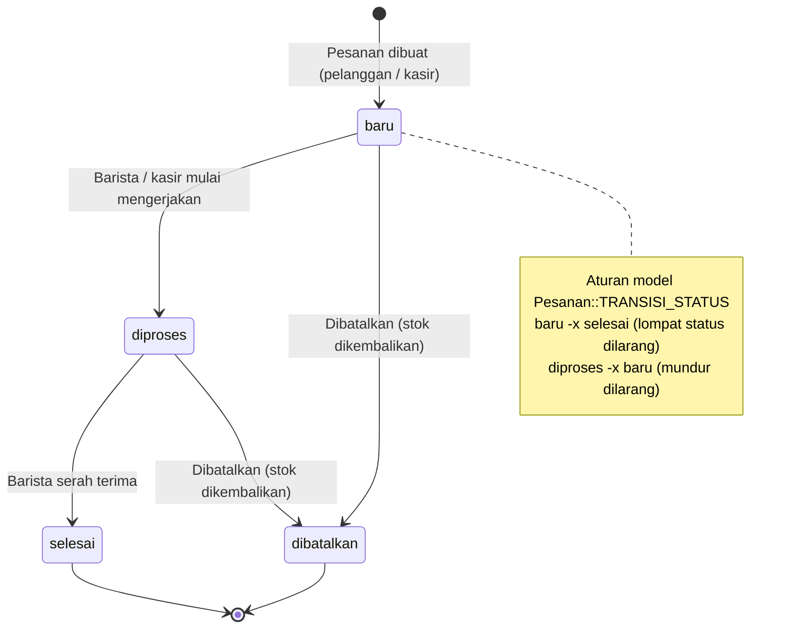
```mermaid
stateDiagram-v2
    [*] --> baru : Pesanan dibuat (pelanggan / kasir)
    baru --> diproses : Barista / kasir mulai mengerjakan
    baru --> dibatalkan : Dibatalkan (stok dikembalikan)
    diproses --> selesai : Barista serah terima
    diproses --> dibatalkan : Dibatalkan (stok dikembalikan)
    selesai --> [*]
    dibatalkan --> [*]

    note right of baru
        Aturan model Pesanan::TRANSISI_STATUS
        baru -x selesai (lompat status dilarang)
        diproses -x baru (mundur dilarang)
    end note
```

### 7.2 State machine status pembayaran

```mermaid
stateDiagram-v2
    [*] --> menunggu : Pesanan dibuat (transaksi otomatis)
    menunggu --> lunas : Kasir tandai lunas / webhook Midtrans
    menunggu --> gagal : QRIS/VA kedaluwarsa atau ditolak
    gagal --> menunggu : Kasir membuat charge ulang
    lunas --> [*]

    note right of lunas
        Saat lunas: poin member += floor(total_harga / 10.000)
        Status pesanan TIDAK otomatis berubah
    end note
```

### 7.3 Alur uang, stok, dan poin

```mermaid
flowchart TD
    A([Pelanggan / Kasir membuat pesanan]) --> B["OrderController::store"]
    B --> C[Kunci produk<br/>lockForUpdate]
    C --> D{Stok cukup?}
    D -- Tidak --> E[422 · pesanan batal]
    D -- Ya --> F[Stok dikurangi]
    F --> G[Pesanan + detail tersimpan]
    G --> H[Hitung: subtotal - voucher - poin + biaya layanan]
    H --> I[Transaksi menunggu dengan total_bayar = 0]

    I --> J{Metode bayar}
    J -- Tunai --> K[Kasir input uang diterima]
    K --> L{Uang >= tagihan?}
    L -- Tidak --> M[Tolak, minta nominal cukup]
    L -- Ya --> N[total_bayar = uang, kembalian = selisih]
    J -- QRIS / VA --> O[Midtrans charge 15 menit]
    O --> P{Status gateway}
    P -- settlement --> Q[total_bayar = gross_amount]
    P -- expire / deny --> R[status gagal, boleh charge ulang]

    N --> S[status_pembayaran = lunas]
    Q --> S
    S --> T[Poin member bertambah<br/>1 poin per Rp 10.000]
    T --> U[Barista memproses di KDS]
    U --> V[Pesanan selesai]
    V --> W[Struk 80 mm dicetak]
    W --> X([Selesai])

    R --> J
    E --> Y([Selesai])
```

### 7.4 Rincian pembentukan total

```mermaid
flowchart LR
    A[Σ harga_satuan × jumlah<br/>per item] --> B[Subtotal]
    B --> C{Pakai voucher?}
    C -- persen --> D[diskon = subtotal × persen]
    C -- nominal --> E[diskon = min nominal, subtotal]
    C -- tidak --> F[diskon voucher = 0]
    D --> G{Pakai poin?}
    E --> G
    F --> G
    G -- ya --> H["poin_dipakai = min saldo, floor total/10<br/>diskon poin = poin × Rp 10"]
    G -- tidak --> I[diskon poin = 0]
    H --> J[+ biaya layanan dari Store Settings]
    I --> J
    J --> K[total_harga = subtotal - diskon + biaya_layanan]
```

> Catatan: angka di dokumen ini mengikuti implementasi kode saat ini
> (`Pesanan::RUPIAH_PER_POIN`, `ReservasiMeja::DURASI_MENIT`,
> `MidtransService::EXPIRY_MINUTES`, `SettingController::defaults()`).
